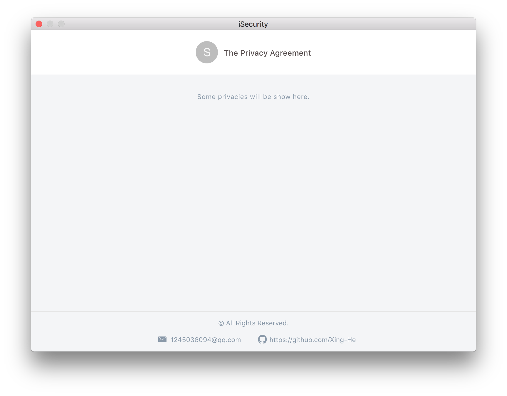

# iSecurity

> Password Management Desktop app developed with Electron + React.

## Run

#### 1. Install dependencies

```bash
yarn install
# npm install
```

#### 2. Run command

```bash
yarn dev
# npm run dev 
```





## The problems that I have encountered

- [Check Problems](./problems.md)