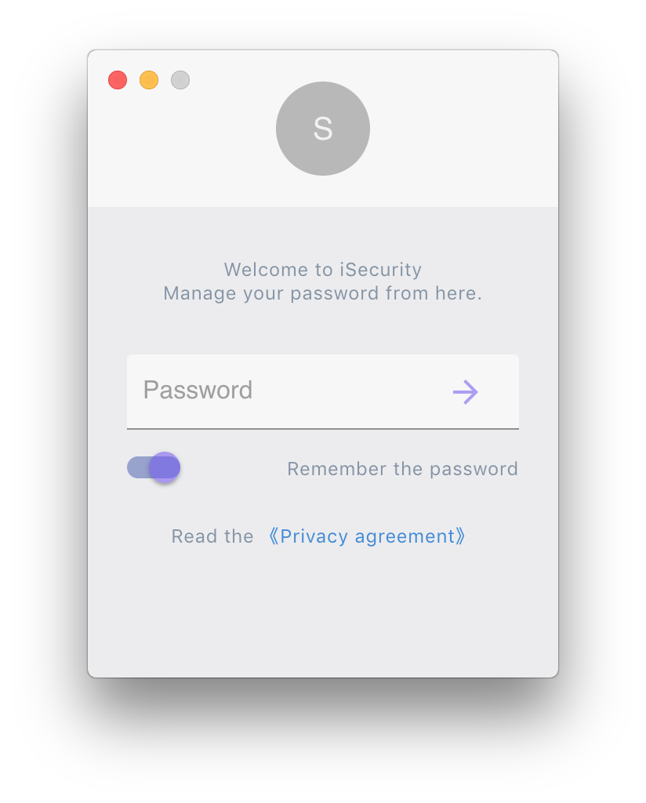

# iSecurity

> Password Management Desktop app developed with Electron + React.

## Run

#### 1. Install dependencies

```bash
yarn install
# npm install
```

#### 2. Run command

```bash
yarn dev
# npm run dev 
```

> ⚠️ we will have to specify the build property, this is because of a minor conflict between create-react-app and electron-builder as both are using the build folder for two different purposes.  
>   
> In order to solve this conflict, we need to manually configure electron-builder’s correct folders for the build step. Add the following build section to the package.json file:  

```
"build": {
  "files": [
    "build/**/*",
    "node_modules/**/*"
  ],
}
```

> ⚠️ We also need to add the homepage property to allow the packaged Electron app to find the JavaScript and CSS files

```
"homepage": "./"
```

- [Reference](http://kazuar.github.io/markdown-app/)

<div align="center">
  
  
</div>
<div align="center">
  
  
</div>
<div align="center">
  
  
</div>

#### 3. Build

```bash
yan dist
# npm run dist
```

## The problems that I have encountered

- [Check Problems](./problems.md)

## License

- [GNU General Public License](./LICENSE.txt)