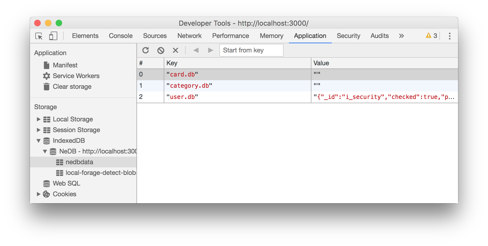

## The problems that I have encountered

> 1. TypeError: fs.existsSync is not a function [Check Answer](https://github.com/electron/electron/issues/9920)

> 2. Error: Application entry file "build/electron.js" in the "xxx/Contents/Resources/app.asar"  
> **Answer** : Rename `main.js` to `electron.js` and move to `public` directory.

> 3. Unable to find **nedb** Generated database file `*.db` [Check Answer](https://github.com/louischatriot/nedb#browser-version)

